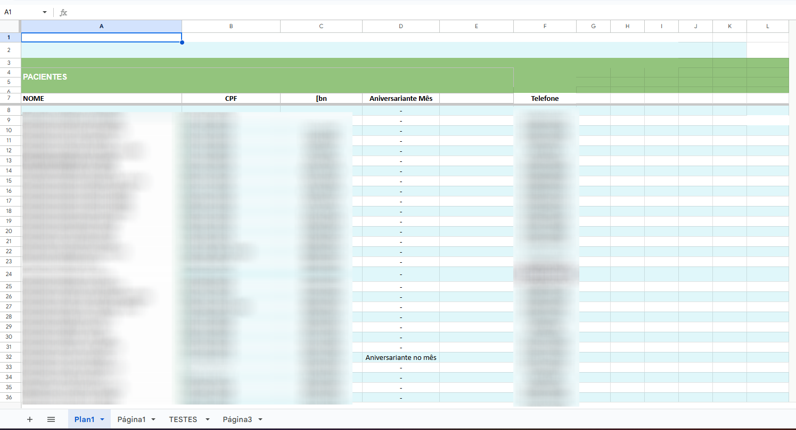
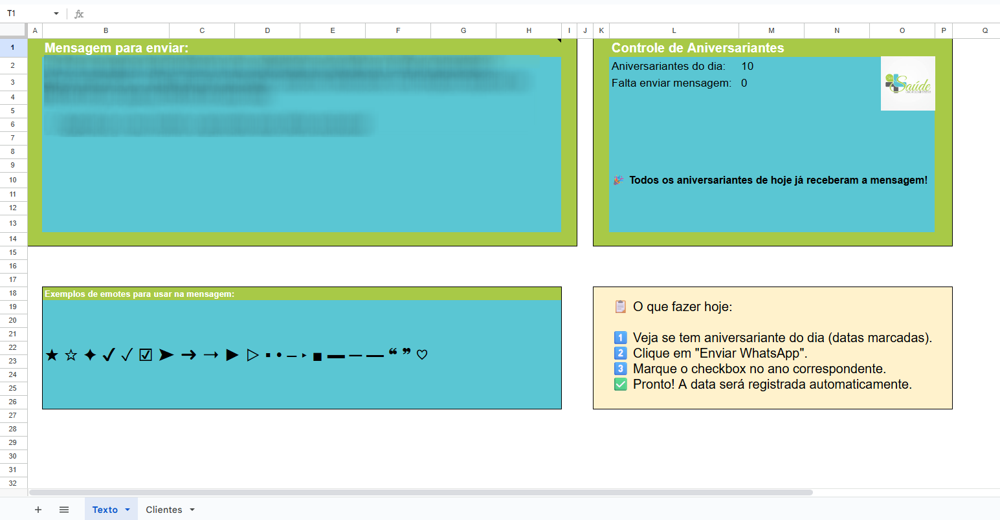
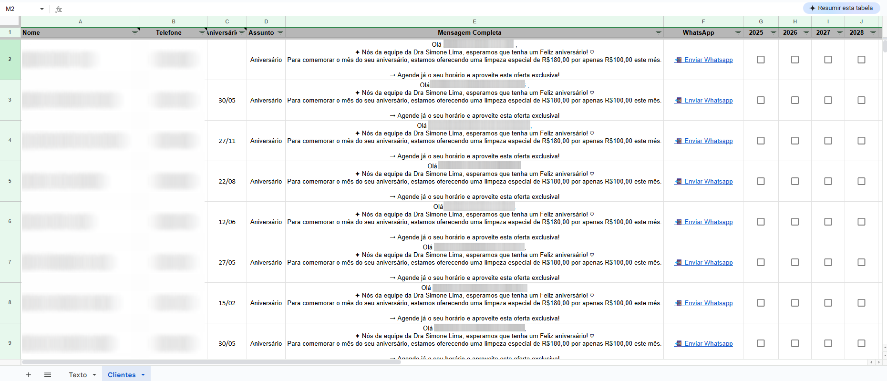
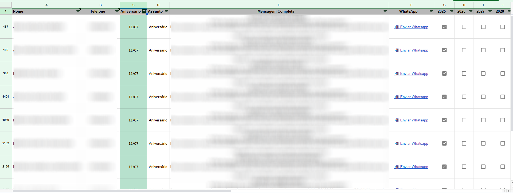

# 📊 Otimização de Planilha de Aniversariantes para Clínica Odontológica

Este projeto consiste na reformulação de uma planilha utilizada por uma clínica odontológica para o envio de mensagens de aniversário aos seus pacientes.

## 🎯 Objetivo

Automatizar e reorganizar o processo de envio de mensagens de aniversário, reduzindo o tempo de operação e facilitando a visualização dos aniversariantes do mês.

---

## 🛠️ Solução

Foi criada uma nova versão da planilha com:

- Separação automática dos aniversariantes do mês atual
- Destaque visual para facilitar o uso
- Fórmulas inteligentes para filtragem e envio rápido
- Interface mais amigável e limpa

---

## ⏱️ Resultados Obtidos

| Métrica                 | Antes              | Depois              |
|------------------------|--------------------|---------------------|
| Tempo por mensagem     | 3 minutos          | 30 segundos         |
| Mensagens por hora     | 20                 | 120                 |
| Ganho de eficiência    | —                  | **6x mais rápido**  |
| Redução de tempo       | —                  | **83,33%**          |

---

## 📸 Comparativo Visual

### 🧾 Planilha Antiga

---

### ✅ Nova Versão da Planilha

---

## 🔐 Privacidade

As imagens foram editadas para remover qualquer dado sensível. Todas as informações de pacientes foram anonimizadas.

---

## 💡 Tecnologias Utilizadas

- Google Sheets
- Fórmulas condicionais (SE, PROCV, FILTRO, etc.)
- Validação de dados
- Organização visual com cores e formatação condicional

